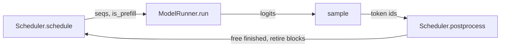

# minivllm

An LLM inference engine written from scratch in PyTorch and Triton — paged KV cache,
continuous batching, and prefix caching, with the attention kernels hand-written
rather than delegated to FlashAttention.

**3.71× the throughput of HuggingFace `generate`** (both batch-tuned) on Qwen3-0.6B,
with outputs verified token-identical to the HuggingFace reference implementation.

```
64 requests x 512 prompt tokens / 128 generated, Tesla T4, fp16

  minivllm      14.6s     560 output tok/s
  HF (best)     54.2s     151 output tok/s      3.71x
```

---

## Contents

- [Why](#why)
- [Quickstart](#quickstart)
- [How it works](#how-it-works)
- [The kernels](#the-kernels)
- [Correctness](#correctness)
- [Benchmarks](#benchmarks)
- [What the numbers mean](#what-the-numbers-mean)
- [Things I learned the hard way](#things-i-learned-the-hard-way)
- [Limitations](#limitations)
- [Repository layout](#repository-layout)

---

## Why

Serving an LLM efficiently is not about the model — it's about everything around it.
A naive implementation reserves a fixed KV buffer per request, runs a fixed batch to
completion, and leaves most of the GPU's memory bandwidth unused. Production engines
solve this with three ideas: **page the KV cache** so memory is allocated in
interchangeable blocks, **rebuild the batch every step** so finished requests leave and
new ones join immediately, and **share identical prefixes** between requests.

This implements all three, and — unlike most reimplementations — writes the attention
kernels itself instead of calling into FlashAttention.

## Quickstart

Requires an NVIDIA GPU (the attention kernels are Triton) and Python 3.11.

```bash
uv sync                     # or: pip install -e .
```

**Chat with it:**

```bash
uv run python chat.py
```

Streams tokens as they are generated, keeps multi-turn history, and reports
time-to-first-token and tok/s per turn. `/stats` shows the cumulative prefix-cache hit
rate — watch TTFT stay flat as the conversation grows, which is the cache doing its job.

**Use it as a library:**

```python
from minivllm.engine.llm_engine import LLMEngine
from minivllm.sampling_params import SamplingParams

engine = LLMEngine("Qwen/Qwen3-0.6B", block_size=16)
out = engine.generate(["The capital of France is"],
                      SamplingParams(temperature=0.7, max_tokens=64))
print(out[0]["text"])
```

**Benchmark it:**

```bash
uv run python bench.py --warmup --num-seqs 64 --input-len 512 --output-len 128 --block-size 16
uv run python compare.py --backend nano --out results/nano.json
uv run python compare.py --backend hf   --out results/hf.json --hf-batch-size 64
uv run python compare.py --compare results/*.json
```

## How it works

Every engine step does four things. `generate()` is a loop over them.



**`Scheduler`** decides who runs. It admits waiting requests as a *prefill* batch if any
fit within the block budget and the per-step token budget; otherwise it runs every
active request as a *decode* batch. Rebuilding the batch on every step is what
"continuous batching" means — a request that finishes at step 4 releases its memory
immediately, and a request that arrives at step 6 joins at step 7 rather than waiting
for the batch to drain. Under memory pressure it preempts the *newest* running request
(the one that has generated least, so the least work is discarded), frees its blocks,
and re-queues it.

**`BlockManager`** owns the physical KV blocks. It maintains one invariant —
`len(seq.block_table) == seq.num_blocks` — and everything else follows from it. Blocks
are reference-counted, and full blocks are content-hashed with a **chained** hash
(block *i*'s hash covers its tokens *and* block *i−1*'s hash) so identical prefixes map
to the same physical block, while identical content at different positions does not
collide. A cache hit bumps a refcount instead of allocating, and advances the
sequence's `num_cached_tokens` so prefill skips work it doesn't need to redo.

**`Sequence`** tracks tokens and `num_cached_tokens` — the number of leading tokens
whose K/V are already in the cache. Every forward pass computes exactly
`[num_cached_tokens, num_tokens)`. Prefill is that range being the whole prompt; decode
is that range being a single token. There is no separate code path for the two, which
is also what makes chunked prefill and preemption-resume fall out for free.

**`ModelRunner`** turns a batch of sequences into tensors: `cu_seqlens_q`/`cu_seqlens_k`
for variable-length packing, a `slot_mapping` giving each new token its physical cache
slot (`block_id * block_size + offset`), and padded `block_tables`. It also sizes the KV
cache at startup by measuring a worst-case forward pass and dividing what's left of VRAM
by the per-block cost.

## The kernels

All four are written in Triton, in `src/minivllm/layers/attention.py`.

| kernel | used for | notes |
|---|---|---|
| `flash_attention_varlen_kernel` | cold prefill | Online-softmax flash attention over packed variable-length sequences. Tiles Q and K/V into SRAM; keeps a running max and sum per query row and rescales the accumulator as new tiles arrive, so it never materializes the N×N score matrix. |
| `paged_prefill_attention_kernel` | prefill with a cached prefix | Same maths, but reads K/V through a block table instead of a contiguous buffer. Handles `k_len > q_len`, offsetting the causal mask by `num_cached` per sequence. This is what makes prefix caching and chunked prefill possible. |
| `paged_attention_decode_kernel` | decode | One program per (sequence, query head). Walks the sequence's block table in `BLOCK_N` chunks, so work is proportional to that sequence's context length. |
| `save_kv_cache_kernel` | every step | Scatters new K/V into the paged cache by `slot_mapping`. A slot of `-1` is skipped. |

Grouped-query attention (Qwen3-0.6B is 16 query heads over 8 KV heads) is handled by
mapping `q_head // (num_q_head // num_kv_head)` to the KV head, which halves KV traffic
during decode — a significant saving, since KV reads dominate the decode step at
realistic context lengths.

All accumulators are fp32 regardless of storage dtype. See
[Things I learned the hard way](#things-i-learned-the-hard-way) for why that turned out
to matter more than expected.

## Correctness

Speed is meaningless without it, so correctness is tested at three levels.

**Kernels vs. a PyTorch reference** — `tests/test_prefill_attention.py`,
`tests/test_paged_attention_decode.py`, `tests/test_paged_prefill_attention.py`. The
paged prefill tests cover `num_cached == 0`, chunked-prefill equivalence, and a
variable-length batch where each sequence has a *different* cached length — the case
where the per-sequence causal offset has to be right.

**Model vs. HuggingFace** — `tests/test_parity.py` loads real Qwen3-0.6B weights and
asserts every parameter was written, that last-token logits match `transformers`, that
the top-5 predictions match, and that 20 greedy tokens are identical. When something
fails it runs forward hooks over both models and reports *which decoder layer* first
diverges, instead of leaving a bare logit difference.

`tests/diagnose_parity.py` is the tool that found the one real bug in the model
(below). It teacher-forces both implementations on identical prefixes and reports
disagreements alongside the top-2 logit gap — which distinguishes "greedy decoding
amplified a near-tie" from "the implementation is wrong."

**Engine vs. itself** — the allocator has property tests
(`tests/test_block_manager.py`) covering conservation, refcounting across shared
prefixes, stale-hash rejection after block reuse, and a randomized workload that
asserts every full block holds exactly the tokens its sequence expects. End to end,
batched output is verified identical to running each request alone — the check that
catches block-table padding and cross-sequence slot collisions.

```
OK  What is the capital of France?
     batched: 'The capital of France is **Paris**.'
     alone  : 'The capital of France is **Paris**.'
```

## Benchmarks

Tesla T4 (16 GB, sm_75), fp16, Qwen3-0.6B, 64 requests × 512 prompt tokens / 128
generated. Both engines batch-tuned; HF was swept across batch sizes and its best result
is the one quoted.

| backend | batch | wall | output tok/s | ms / decode step | ms / token |
|---|---|---|---|---|---|
| HuggingFace | 8 | 67.6s | 121 | 66 | 8.25 |
| HuggingFace | 16 | 59.9s | 137 | 117 | 7.32 |
| HuggingFace | 32 | 56.2s | 146 | 220 | 6.86 |
| HuggingFace | 64 | 54.2s | 151 | 424 | 6.62 |
| **minivllm** | **64** | **14.6s** | **560** | **53** | **0.83** |

**Prefix caching**, same workload with a 256-token prefix shared across all 64 prompts:

| | prefill | decode | wall |
|---|---|---|---|
| no shared prefix | 7.32s | 6.73s | 14.05s |
| 256-token shared prefix | 5.37s | 6.55s | 11.91s |

49% of prompt tokens were served from cache, cutting wall time 15%. Decode is unchanged,
as it should be — the cache only removes prefill work.

## Limitations

- **Single GPU.** The tensor-parallel layers (column/row/merged-QKV parallel linear,
  vocab-parallel embedding) are implemented, but nothing has been run at
  `world_size > 1`, so it isn't claimed to work.
- **No CUDA graphs.** Decode launches kernels eagerly every step; capturing the decode
  step is the most obvious remaining throughput win.
- **No chunked prefill.** The kernel supports it and it is tested, but the scheduler
  does not yet mix prefill chunks into decode batches, so a long prompt still stalls
  every running request for the duration of its prefill.
- **Qwen3 only.** Adding an architecture means a model file and a
  `packed_modules_mapping`; the loader and engine are model-agnostic.
- **Greedy and temperature sampling only** — no top-p / top-k.
- Benchmarked on a T4 (sm_75). bf16 is emulated there, so fp16 is used throughout;
  numbers on an Ampere or later card would look different.

## Repository layout

```
src/minivllm/
  layers/
    attention.py      4 Triton kernels + the Attention module that dispatches them
    linear.py         replicated / column / row / merged-QKV parallel linear
    rope.py           rotary embeddings with a precomputed cos/sin cache
    layernorm.py      RMSNorm (fp32 reduction)
    activation.py     SiLU-and-multiply
    embed_head.py     vocab-parallel embedding and LM head
  model/qwen3.py      Qwen3 assembled from the layers above
  engine/
    llm_engine.py     public API: add_request / step / generate
    scheduler.py      continuous batching, admission, preemption
    block_manager.py  paged allocator with hashed prefix sharing
    sequence.py       per-request token and cache state
    model_runner.py   tensor building, KV cache allocation, forward
    sampler.py        greedy / temperature
  utils/
    loader.py         safetensors -> model, including fused QKV and gate_up
    context.py        per-step metadata the attention layers read
tests/                kernel, model-parity, and allocator tests
bench.py              throughput benchmark, prefill and decode timed separately
compare.py            same workload across minivllm / HuggingFace / vLLM
chat.py               interactive multi-turn chat
```

## References

- [Efficient Memory Management for Large Language Model Serving with PagedAttention](https://arxiv.org/abs/2309.06180) — the vLLM paper
- [FlashAttention](https://arxiv.org/abs/2205.14135) — the online-softmax formulation the prefill kernels use
- [nano-vllm](https://github.com/GeeeekExplorer/nano-vllm) — reference for the engine architecture; the kernels here are written from scratch rather than delegated to FlashAttention
